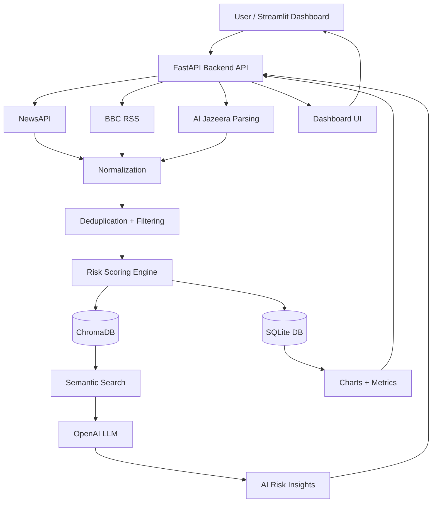

# 🛡️ Aegis-Risk

### AI-Powered Supply Chain Risk Intelligence Platform

---

## 🚀 Overview

**Aegis-Risk** is an end-to-end AI system that monitors global news, detects geopolitical risk signals, and explains their impact on supply chains using AI.

It combines:

- Multi-source news ingestion
- Risk scoring
- Vector search (RAG)
- AI-generated structured insights
- Interactive dashboard

---

## 🎯 Project Goal

To answer:

> **How can AI continuously monitor global news and explain supply-chain risk in real time?**

This system transforms raw news into:

- Risk scores
- Actionable insights
- AI explanations

---

## ✨ Key Features

- 🔄 Multi-source news ingestion
  - NewsAPI
  - BBC RSS
  - Al Jazeera parsing

- 🧠 Risk scoring engine (NLP + rules)

- 🔍 Semantic search (ChromaDB)

- 🤖 AI-powered explanations
  - Risk level
  - Key drivers
  - Watchpoints

- 📊 Interactive dashboard
  - Charts
  - Alerts
  - Risk breakdown

- 📚 Source-backed answers (RAG)

---

## 🧠 System Architecture

