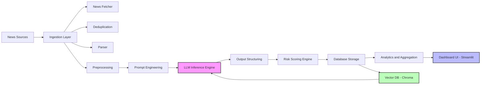
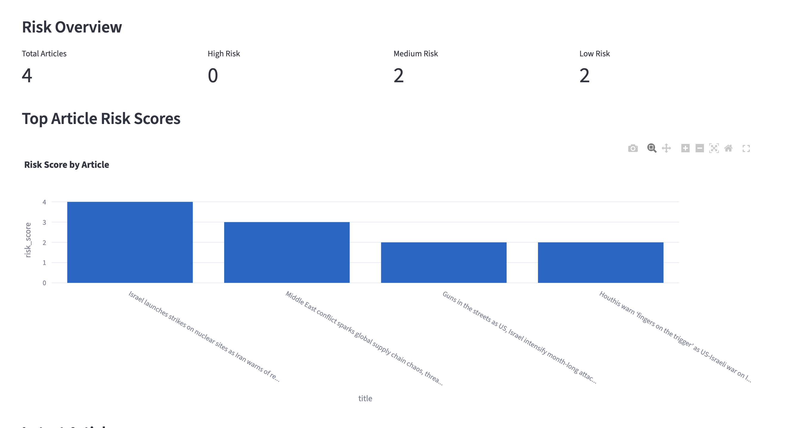
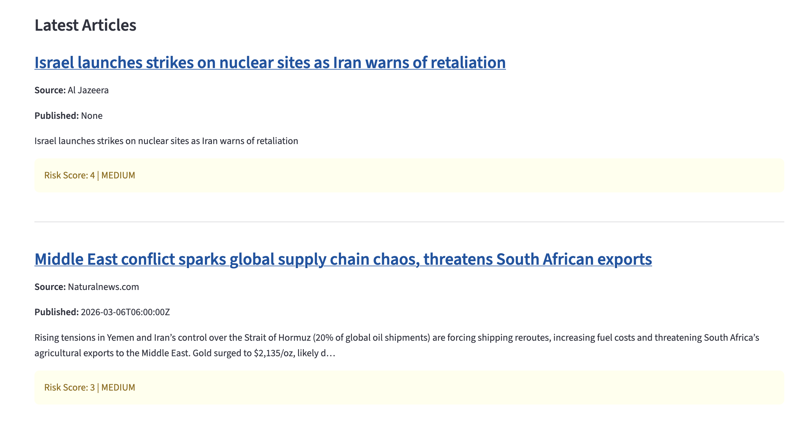
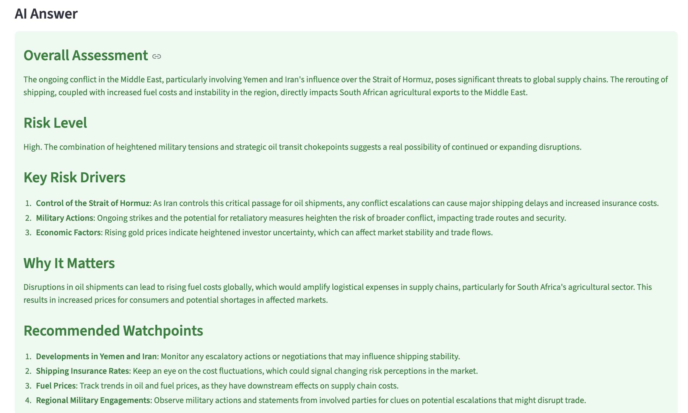

# AEGIS-RISK: LLM-Powered Risk Intelligence & Monitoring System

> An end-to-end AI system that transforms real-time news into structured risk intelligence using LLM-based reasoning.

---

## Overview

AEGIS-RISK is an end-to-end applied AI system that transforms real-time geopolitical and supply-chain news into structured, decision-ready risk intelligence using Large Language Models (LLMs).

The system ingests live news, processes and deduplicates content, applies prompt-engineered LLM reasoning, and produces structured outputs including risk scores, key drivers, summaries, and monitoring signals — all surfaced through an interactive dashboard.

This project is positioned as a **research-oriented prototype for AI-assisted decision support**, exploring how LLMs can be used beyond text generation for structured reasoning system.

---

## Problem Statement

Modern risk assessment systems face key limitations:

- Dependence on structured datasets and static rules
- Limited ability to process real-time unstructured information
- Heavy reliance on manual expert interpretation
- Lack of scalability in fast-changing geopolitical environments

### Goal

To explore how AI systems can:

- Interpret unstructured news data
- Extract meaningful risk signals
- Generate structured, explainable risk insights
- Support decision-making in dynamic environments

---

## Key Features

AEGIS-RISK provides a full pipeline for real-time risk intelligence:

- Real-time news ingestion from multiple sources
- Deduplication and preprocessing of articles
- LLM-based risk reasoning and structured analysis
- Risk scoring (article-level and aggregated)
- Identification of key risk drivers and watchpoints
- Interactive dashboard for monitoring and analytics
- Retrieval-ready architecture using vector database (ChromaDB)

---

## Architecture Overview

### End-to-End Pipeline

News Sources → Ingestion → Deduplication → Parsing → Preprocessing → Prompt Engineering → LLM Inference → Output Structuring → Risk Scoring → Database Storage → Analytics & Aggregation → Dashboard

---

## Architecture Diagram



This architecture represents a complete applied AI pipeline integrating:

- Real-time data ingestion
- LLM-based structured reasoning
- Vector-based retrieval (RAG-ready design)
- Data storage and analytics
- Interactive dashboard for monitoring

---

## 📊 System Interface & Outputs

### Dashboard Overview


### Risk Analysis Output



### Article Risk Scoring



### AI Answer



### News Sources


---

## 💡 Why This Matters

Traditional risk analysis relies heavily on manual interpretation and structured datasets.

AEGIS-RISK demonstrates how AI systems can:

- Process unstructured real-time information
- Generate structured, explainable insights
- Support faster and more scalable decision-making

---

## 🧠 Challenges & Learnings

- Ensuring consistency and reliability in LLM outputs
- Designing prompts for structured reasoning (not just text generation)
- Handling duplicate and noisy real-world news data
- Transforming unstructured text into decision-ready formats
- Balancing flexibility of LLMs with controlled outputs

---

## Key Features

### LLM-Based Risk Reasoning

- Converts unstructured news into structured intelligence
- Uses prompt engineering to guide consistent outputs

### Structured Outputs

- Risk classification (Low / Medium / High)
- Risk scoring
- Key drivers and explanations

### Real-Time Monitoring

- Live news ingestion
- Refreshable dashboard

### Analytical Dashboard

- Risk distribution (High / Medium / Low)
- Average risk score
- Top risk articles
- Trend visualisation

### Modular Architecture

- Clean separation of ingestion, processing, and inference
- Easily extensible for future features (RAG, agents)

---

## System Components

### 1. Ingestion Layer (`ingestion/`)

- `news_fetcher.py` – Fetches live news data
- `dedupe.py` – Removes duplicate articles
- `parser.py` – Extracts and structures content
- `scheduler.py` – Automates periodic ingestion

### 2. Core Infrastructure (`core/`)

- `config.py` – Configuration management
- `database.py` – Storage and persistence layer

### 3. LLM & Retrieval (`rag/`)

- `llm_answer.py` – LLM interaction and reasoning logic
- `vectordb.py` – Vector storage for retrieval (RAG-ready)

### 4. API Layer (`api/`)

- `routes/` – API endpoints
- `schemas/` – Data validation and structure
- `main.py` – API entry point

### 5. Services (`services/`)

- `article_service.py` – Business logic for processing articles

### 6. Data Models (`models/`)

- `article.py` – Article schema and structure

### 7. User Interface (`ui/`)

- `streamlit_app.py` – Interactive dashboard for monitoring risk insights

### 8. Storage

- `aegis_risk.db` – SQLite database
- `chroma_db/` – Vector database for embeddings

---

## Example Outputs

The system produces:

- Overall risk assessment summaries
- Article-level risk scores
- Key risk drivers (geopolitical, economic, operational)
- Recommended watchpoints

Additionally:

- Aggregated metrics (average risk score)
- Risk distribution across articles
- Visual dashboards for monitoring trends

---

## Engineering Design Principles

### Modularity

- Clear separation between ingestion, inference, and UI

### Reproducibility

- Structured pipelines and deterministic workflows where possible

### Scalability (Conceptual)

- Designed to integrate with streaming data and APIs

### Maintainability

- Clean project structure with isolated components

---

## Research Perspective

This project explores:

- LLMs for structured reasoning tasks
- Reliability and consistency of AI-generated assessments
- Converting unstructured text into decision-ready intelligence

It represents early-stage work in:

- Generative AI
- Applied AI systems
- AI-driven risk intelligence

---

## Limitations

- LLM outputs may vary across runs
- Limited quantitative evaluation framework
- Not production-ready (research prototype)

---

## Future Work

- Retrieval-Augmented Generation (RAG) integration
- Agentic workflows with iterative reasoning
- Feedback loops for self-improving predictions
- Benchmark-based evaluation metrics
- Domain-specific fine-tuning

---

## Tech Stack

- Python
- FastAPI
- Streamlit
- SQLite
- ChromaDB (vector database)
- LLM APIs (e.g., OpenAI)
- Pandas / NumPy

---

## Installation & Setup

```bash
# Clone repository
git clone https://github.com/your-username/AEGIS-RISK.git
cd AEGIS-RISK

# Create virtual environment
python -m venv .venv
source .venv/bin/activate  # or .venv\Scripts\activate on Windows

# Install dependencies
pip install -r requirements.txt

# Configure environment variables
cp .env.example .env
```

---

## Running the System

### Start API

```bash
python app/api/main.py
```

### Run Dashboard

```bash
streamlit run app/ui/streamlit_app.py
```

---

## Repository Structure

```
app/
 ├── api/
 ├── core/
 ├── ingestion/
 ├── models/
 ├── rag/
 ├── services/
 ├── ui/

chroma_db/
aegis_risk.db
README.md
requirements.txt
```

---

## Positioning

AEGIS-RISK is an **applied AI system** that demonstrates:

- End-to-end LLM pipeline design
- Real-time data ingestion and processing
- Structured reasoning using generative AI
- Decision-support system development

This project reflects early-stage capabilities in:

- Generative AI
- Applied machine learning systems
- AI-driven risk intelligence

---

## Author

Sabbir Ahmed  
Research-oriented Data Scientist focused on applied AI, ML systems, and decision-support technologies
