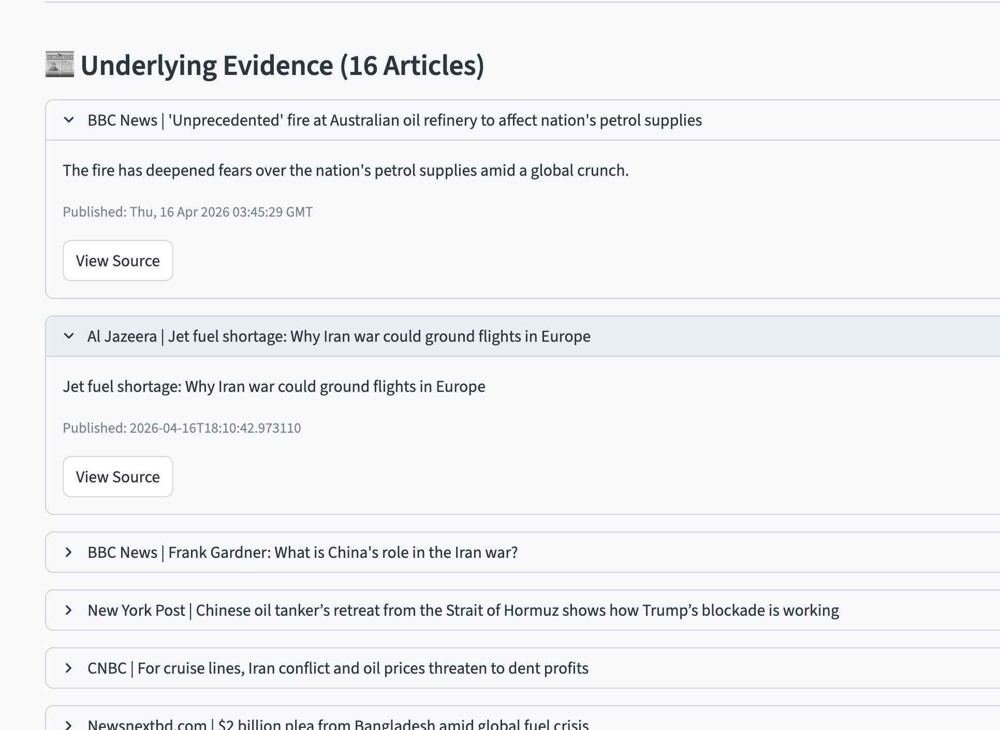

# 🛡️ Aegis-Risk: Agentic Geopolitical Risk Monitor

Aegis-Risk is an **LLM-powered multi-agent system** for real-time geopolitical risk analysis, focused on **critical infrastructure domains such as oil transit routes, maritime chokepoints, and global energy supply chains**.

The system implements a **Medallion Architecture (Bronze → Silver → Gold)** combined with **multi-model adversarial verification**, enabling **high-confidence, evidence-backed risk assessments**.

---

## 🚀 Key Features

- 🧠 **Multi-Agent AI System**
  - Lead Analyst (GPT-4o)
  - Verification Critic (Claude 4.6)
  - Optional Refiner (LLaMA / Groq)

- 🏗️ **Medallion Data Architecture**
  - Bronze: Raw ingestion (audit trail)
  - Silver: Cleaned + structured articles
  - Gold: Risk scoring + trend analysis

- 🔍 **Targeted Geopolitical Retrieval**
  - Precision filtering for oil transit, maritime routes, chokepoints

- 📊 **Explainable Risk Scoring**
  - Evidence-backed outputs with supported/unsupported claims

- 🧾 **Verifiable AI Outputs**
  - Each claim tied to source articles
  - Critic identifies hallucinations & gaps

---

## 🧠 System Architecture Overview

Aegis-Risk integrates **data engineering + retrieval + LLM reasoning** into a unified pipeline:

```
News Sources (NewsAPI, RSS, Web Scraping)
            ↓
        Bronze Layer (Raw JSON Storage)
            ↓
   Normalization + Cleaning Pipeline
            ↓
        Silver Layer (SQLite)
            ↓
   Relevance Filtering (Vector Gate)
            ↓
        Vector DB (Chroma)
            ↓
   Retrieval-Augmented Generation (RAG)
            ↓
   Multi-Agent Reasoning System
            ↓
        Gold Layer (Risk Index)
            ↓
        Streamlit UI
```

---

## System Architecture

## 

## Dashboard Preview




---

## 🏛️ Medallion Architecture

### 🥉 Bronze Layer

- Raw, unmodified article ingestion
- Stored for auditability and reproducibility
- Sources:
  - NewsAPI
  - BBC RSS
  - Al Jazeera scraping
  - Tehran Times, Jerusalem Post

---

### 🥈 Silver Layer

- Cleaned and normalized articles
- Stored in SQLite
- Enriched with:
  - Title
  - Summary
  - Full content extraction
  - Metadata (source, timestamp)

---

### 🥇 Gold Layer

- LLM-generated geopolitical risk assessments
- Time-series risk scoring
- Multi-model consensus output

---

## 🔍 Vector Relevance Filtering (Key Innovation)

Aegis-Risk introduces a **semantic gating mechanism** before vector indexing:

```python
VECTOR_KEYWORDS = [
    "oil tanker", "shipping lane", "oil transit",
    "maritime route", "strait", "chokepoint",
    "blockade", "navy", "pipeline"
]
```

Only **transit-relevant articles** are embedded into ChromaDB.

👉 This prevents:

- Noise pollution
- Political-only articles
- Irrelevant macroeconomic news

---

## 🤖 Multi-Agent AI System

### 1. Lead Analyst (GPT-4o)

- Generates structured risk report:
  - Introduction
  - Risk factors
  - Mitigations
  - Recommendations
  - Risk score (1–5)

---

### 2. Verification Critic (Claude 4.6)

- Validates all claims
- Categorizes:
  - ✅ Supported
  - ❌ Unsupported
  - ⚠ Missing Evidence

---

### 3. Refiner (Optional)

- Improves clarity and structure
- Reduces redundancy

---

## 🔁 Workflow

1. Trigger ingestion:

   ```
   POST /api/news/refresh
   ```

2. Load context:

   ```
   GET /api/news/latest
   ```

3. Run analysis:

   ```
   POST /api/news/ask
   ```

---

## 🖥️ UI (Streamlit)

Features:

- Topic filtering (e.g., "oil", "iran")
- Risk trend visualization
- Evidence inspection (expandable articles)
- Multi-agent output panels

---

## 📊 Example Output

- Risk Score: **3–4 (Moderate to High)**
- Focus:
  - Strait of Hormuz disruptions
  - Naval blockades
  - Tanker movement constraints

---

## 🧪 Research Contribution

This system contributes:

- **Agentic AI for geopolitical intelligence**
- **Verifiable multi-model reasoning**
- **Hybrid data architecture (Medallion + RAG)**
- **Noise-resistant retrieval via semantic gating**

---

## 📌 Future Work

- Chokepoint-specific scoring (Hormuz, Suez, Bab el-Mandeb)
- Real-time streaming ingestion
- Graph-based geopolitical entity linking
- Quantitative risk calibration using market data

---

## 🛠️ Tech Stack

- Python (FastAPI, SQLAlchemy)
- Streamlit (UI)
- ChromaDB (Vector DB)
- OpenAI GPT-4o
- Anthropic Claude 4.6
- BeautifulSoup + RSS parsing

---

## 👤 Author

Sabbir Ahmed
Research-oriented Data Scientist focused on applied AI, ML systems, and decision-support technologies
