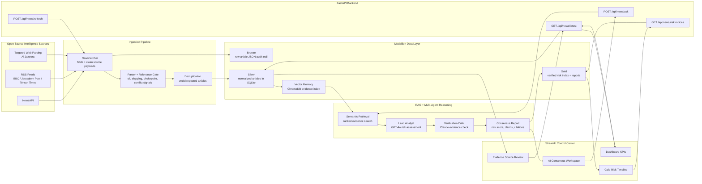
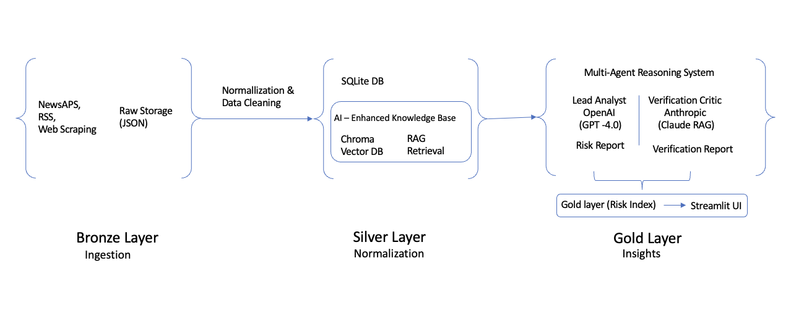
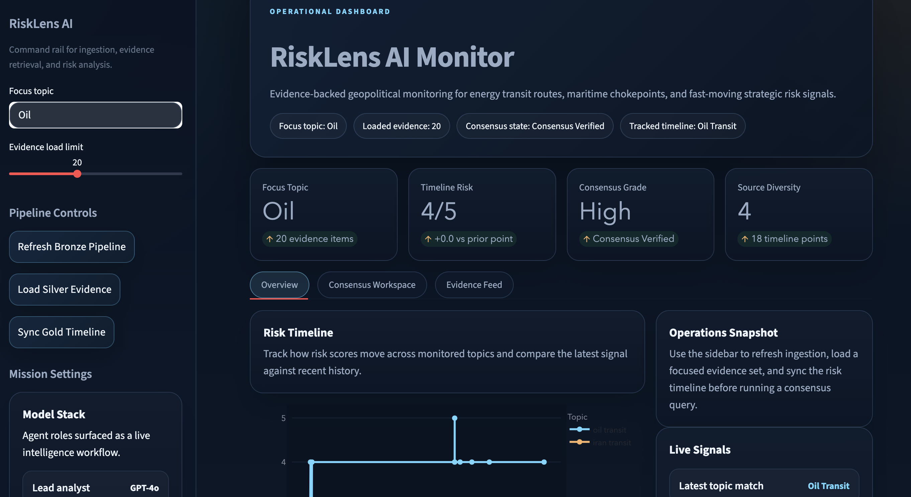
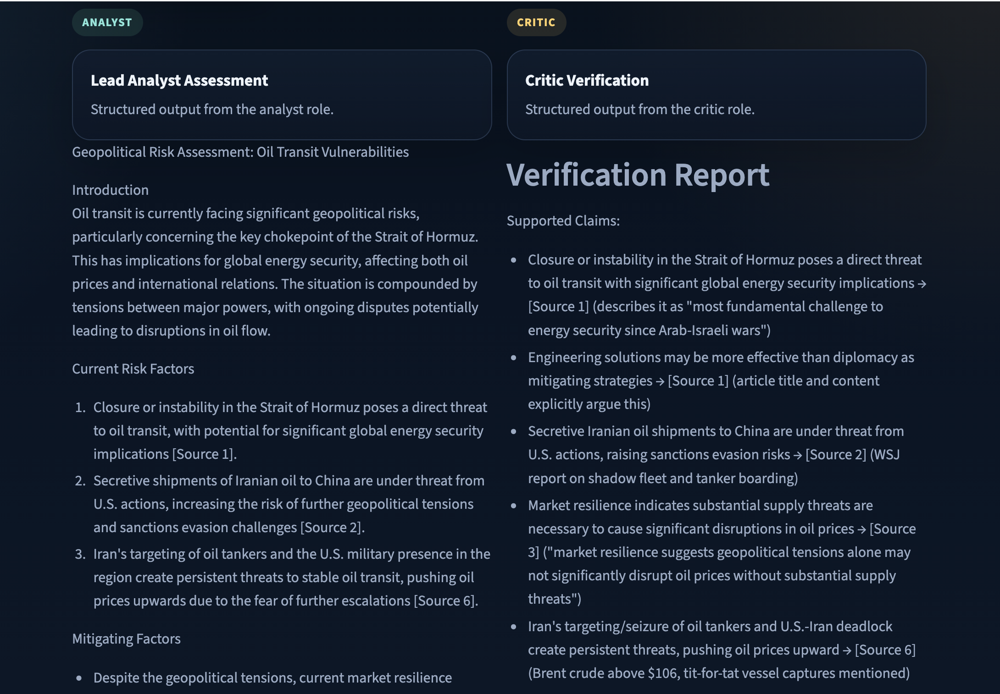

# RiskLens AI: Geopolitical Risk Monitor

RiskLens AI is an LLM-powered multi-agent system for real-time geopolitical risk analysis across critical infrastructure domains such as oil transit routes, maritime chokepoints, and global energy supply chains.

The project combines a Medallion-style data pipeline, retrieval-augmented generation, and adversarial multi-model verification to produce evidence-backed risk assessments with source visibility.

## Project Goal

The goal of RiskLens AI is to turn fast-moving global news into clear, evidence-backed risk intelligence. Instead of simply summarizing articles, the system filters noisy open-source reporting, retrieves the most relevant evidence, and produces verified geopolitical risk assessments that help analysts understand potential disruption to oil transit, shipping lanes, and energy supply chains.

RiskLens AI is built as a practical decision-support tool for:

- monitoring emerging geopolitical and maritime disruption signals
- tracking risk trends over time through a Gold-layer risk index
- grounding AI-generated assessments in retrieved source articles
- making complex risk information easier to inspect through a dashboard

## Key Features

- Multi-agent reasoning workflow
  - Lead Analyst: GPT-4o
  - Verification Critic: Claude 4.6
  - Optional Refiner: Groq / Llama-3
- Medallion architecture
  - Bronze: raw ingestion and audit trail
  - Silver: cleaned and structured articles
  - Gold: risk scoring and historical trend tracking
- Geopolitical retrieval focused on oil transit, chokepoints, shipping lanes, and disruption signals
- Evidence-backed outputs tied to source articles
- Streamlit control-center dashboard for operators and demos

## System Overview

RiskLens AI is built as an end-to-end geopolitical risk intelligence pipeline. It collects open-source news, filters for operationally relevant disruption signals, stores clean evidence, retrieves the most relevant context for user questions, and generates verified risk assessments through a two-agent LLM workflow.

The system is organized around four main layers:

- **Ingestion Layer**: pulls articles from NewsAPI, BBC RSS, Al Jazeera, and other regional sources.
- **Medallion Data Layer**: preserves raw records in Bronze, stores normalized articles in Silver, and persists verified risk scores in Gold.
- **RAG + Agentic Reasoning Layer**: retrieves evidence from ChromaDB, generates an analyst report with GPT-4o, and verifies it with Claude.
- **Application Layer**: exposes FastAPI endpoints and a Streamlit dashboard for refresh, search, risk timeline, source review, and AI-generated assessment.

## System Architecture





## Dashboard Preview





## Run Locally

### 1. Create and activate a virtual environment

```bash
python3 -m venv .venv
source .venv/bin/activate
```

### 2. Install dependencies

```bash
pip install -r requirements.txt
```

### 3. Configure environment variables

Create a `.env` file in the project root with the required keys:

```env
NEWSAPI_KEY=your_newsapi_key
OPENAI_API_KEY=your_openai_key
ANTHROPIC_API_KEY=your_anthropic_key
GROQ_API_KEY=your_groq_key
DATABASE_URL=sqlite:///./aegis_risk.db
REFRESH_MINUTES=60
DEFAULT_QUERY=Israel Iran Red Sea Suez oil shipping fuel supply chain
```

Environment variables are loaded from `app/core/config.py`.

### 4. Start the FastAPI backend

```bash
uvicorn app.api.main:app --reload
```

The API will be available at:

- `http://127.0.0.1:8000`
- `http://127.0.0.1:8000/docs`

### 5. Start the Streamlit dashboard

Open a second terminal, activate the same environment, then run:

```bash
streamlit run app/ui/streamlit_app.py
```

The dashboard usually opens at:

- `http://localhost:8501`

## Workflow

1. Refresh the Bronze pipeline to ingest and promote news data.
2. Load Silver evidence for a topic such as `oil`, `iran`, or `red sea`.
3. Sync the Gold timeline to visualize historical risk scores.
4. Run a consensus query so the analyst and critic debate the currently loaded evidence.

Core endpoints:

```text
POST /api/news/refresh
GET  /api/news/latest
POST /api/news/ask
GET  /api/news/risk-indices
```

## Dashboard Experience

The Streamlit UI is designed as a dashboard-style control center with:

- a command sidebar for ingestion, evidence loading, and timeline sync
- summary KPI cards for focus topic, timeline risk, consensus grade, and source diversity
- a historical Gold-layer risk chart
- a consensus workspace for analyst and critic outputs
- an evidence feed with source cards and direct links to underlying articles

## Medallion Architecture

### Bronze Layer

- Raw, unmodified article ingestion
- Auditability and reproducibility of upstream data
- News sources including NewsAPI, RSS feeds, and targeted scraping

### Silver Layer

- Cleaned and normalized articles stored in SQLite
- Enriched article metadata such as title, summary, source, timestamp, and content

### Gold Layer

- LLM-generated geopolitical risk assessments
- Time-series risk scoring
- Multi-model consensus output

## Vector Relevance Filtering

Before indexing into ChromaDB, the system uses semantic gating to keep only transit-relevant reporting:

```python
VECTOR_KEYWORDS = [
    "oil tanker", "shipping lane", "oil transit",
    "maritime route", "strait", "chokepoint",
    "blockade", "navy", "pipeline"
]
```

This helps reduce:

- noise pollution
- political-only articles with weak operational relevance
- irrelevant macroeconomic coverage

## Multi-Agent AI System

### Lead Analyst

- Generates the main geopolitical risk report
- Surfaces risk factors, mitigation ideas, recommendations, and a risk score

### Verification Critic

- Validates whether claims are supported by retrieved evidence
- Flags unsupported or weakly grounded reasoning

### Refiner

- Optional cleanup stage for clarity and structure

## Example Output

- Risk score: 3-4 out of 5
- Typical focus areas:
  - Strait of Hormuz disruption risk
  - naval blockades
  - tanker movement constraints

## Project Structure

```text
app/
  api/         FastAPI routes and schemas
  core/        configuration and database setup
  ingestion/   news fetch, parsing, dedupe, scheduler
  models/      SQLAlchemy models
  rag/         vector search and LLM consensus logic
  services/    article retrieval services
  ui/          Streamlit dashboard
```

## Tech Stack

- Python
- FastAPI
- SQLAlchemy
- Streamlit
- ChromaDB
- OpenAI
- Anthropic
- Groq
- BeautifulSoup
- RSS parsing

## Future Work

- chokepoint-specific scoring for Hormuz, Suez, and Bab el-Mandeb
- real-time streaming ingestion
- graph-based geopolitical entity linking
- quantitative risk calibration using market data

## Author

Sabbir Ahmed  
Research-oriented Data Scientist focused on applied AI, ML systems, and decision-support technologies
