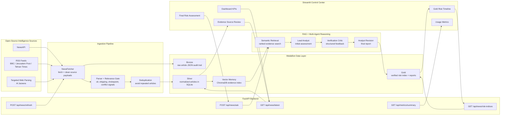
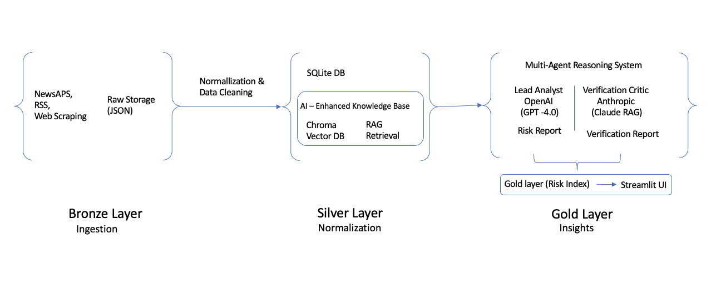
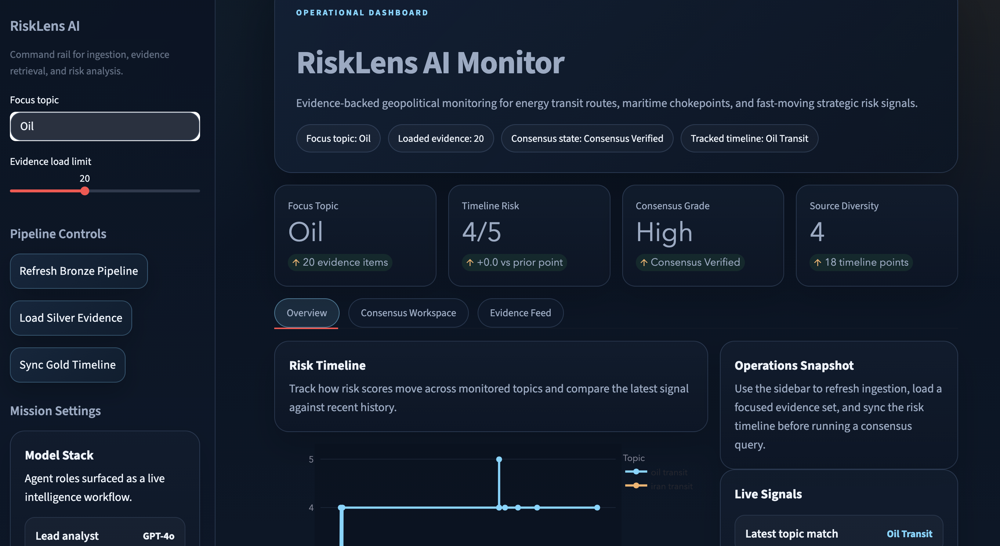
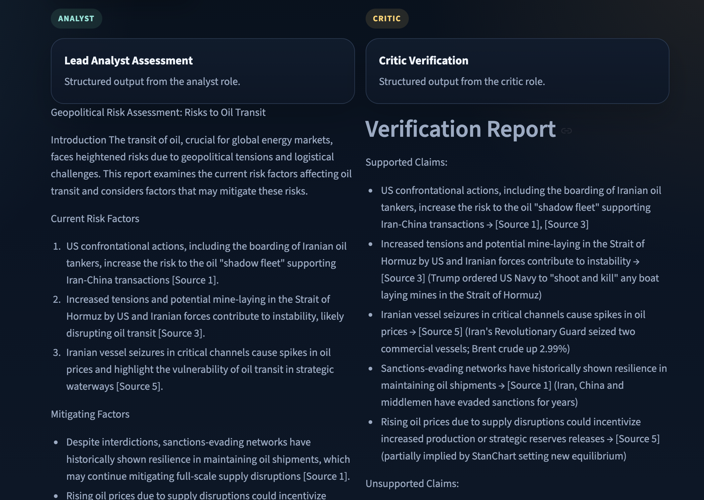
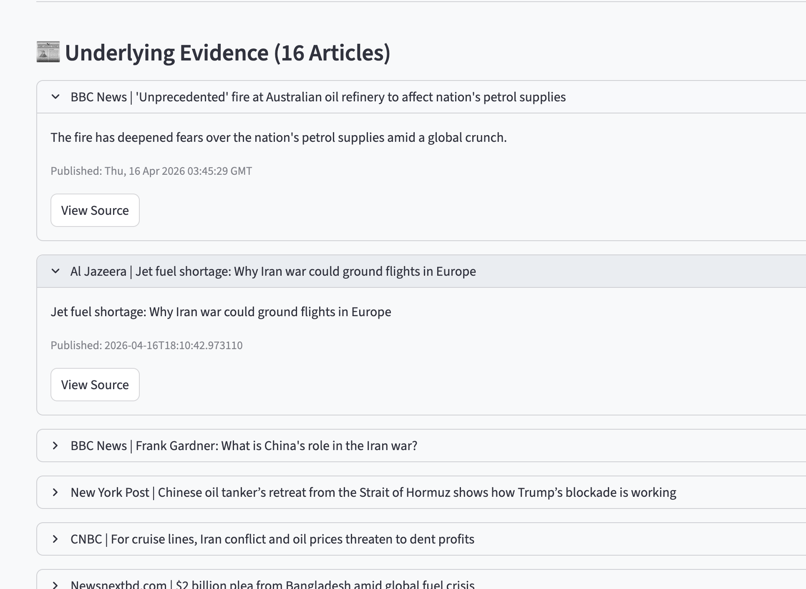

# AEGIS-RISK / RiskLens AI

AEGIS-RISK / RiskLens AI is a production-minded GenAI risk intelligence platform for evidence-grounded geopolitical monitoring. It combines open-source news ingestion, a Bronze / Silver / Gold data pipeline, RAG evidence retrieval, an analyst -> critic -> revision workflow, LLM/RAG evaluation checks, prompt governance, persona-based assistants, privacy-conscious usage metrics, and a Streamlit operational dashboard.

This is a portfolio / prototype system that demonstrates enterprise AI enablement patterns. It is not presented as a fully production-deployed or regulated risk platform.

## Problem Statement

Business users need timely risk intelligence, but raw news feeds are noisy, duplicated, and difficult to turn into decision-ready analysis. LLM outputs also need grounding, verification, uncertainty handling, and human review before they can support operational decisions.

Enterprise AI systems need more than a model call. They need reusable workflows, prompt governance, evaluation, adoption monitoring, error handling, and clear escalation points. RiskLens AI demonstrates those patterns in the context of geopolitical and supply-chain risk monitoring.

## Business Value

RiskLens AI helps teams:

- reduce manual monitoring effort across news and risk signals
- produce evidence-backed decision support with source references
- surface uncertainty, missing evidence, and escalation points
- support senior-management updates and analyst review workflows
- operationalize reusable AI assistants, prompts, evaluation, and usage metrics

## Key Features

- Medallion-style Bronze / Silver / Gold data pipeline
- NewsAPI, RSS, and targeted web parsing ingestion
- Transit-focused article filtering and deduplication
- ChromaDB-backed RAG evidence retrieval
- Analyst -> Critic -> Revision workflow for final assessments
- Final Risk Assessment with risk score, summary, evidence, uncertainty notes, and human review points
- Local LLM/RAG evaluation module with pass / warning / fail checks
- Enterprise-style prompt library with metadata, versions, and lifecycle status
- Persona-based assistant registry for analyst, executive, compliance, and market-intelligence users
- Privacy-conscious adoption and usage metrics
- AI enablement playbooks / knowledge hub documentation
- FastAPI backend and Streamlit dashboard
- Pytest suite, logging, and production-oriented error handling

## Architecture Overview

RiskLens AI is organized as an end-to-end risk intelligence workflow:

- **Sources**: NewsAPI, RSS feeds, and targeted web parsing collect open-source reporting.
- **Bronze**: raw source payloads are preserved for auditability.
- **Silver**: articles are cleaned, normalized, deduplicated, filtered, and promoted into SQLite and ChromaDB.
- **Gold**: RAG retrieves relevant evidence and the analyst -> critic -> revision workflow generates final risk assessments.
- **Consumption**: FastAPI exposes refresh, latest news, ask, timeline, and metrics endpoints; Streamlit provides an operational dashboard.
- **Governance layers**: evaluation checks, prompt library, assistant registry, usage metrics, and playbooks support responsible AI enablement.


```mermaid
flowchart LR
    subgraph Sources["Open-Source Intelligence Sources"]
        NewsAPI["NewsAPI"]
        RSS["RSS Feeds<br/>BBC / Jerusalem Post / Tehran Times"]
        Web["Targeted Web Parsing<br/>Al Jazeera"]
    end

    subgraph Ingestion["Ingestion Pipeline"]
        Fetcher["NewsFetcher<br/>fetch + clean source payloads"]
        Parser["Parser + Relevance Gate<br/>oil, shipping, chokepoint, conflict signals"]
        Dedupe["Deduplication<br/>avoid repeated articles"]
    end

    subgraph Medallion["Medallion Data Layer"]
        Bronze["Bronze<br/>raw article JSON audit trail"]
        SilverDB["Silver<br/>normalized articles in SQLite"]
        Chroma["Vector Memory<br/>ChromaDB evidence index"]
        Gold["Gold<br/>verified risk index + reports"]
    end

    subgraph API["FastAPI Backend"]
        Refresh["POST /api/news/refresh"]
        Latest["GET /api/news/latest"]
        Ask["POST /api/news/ask"]
        Timeline["GET /api/news/risk-indices"]
        Metrics["GET /api/metrics/summary"]
    end

    subgraph Intelligence["RAG + Multi-Agent Reasoning"]
        Retrieve["Semantic Retrieval<br/>ranked evidence search"]
        Analyst["Lead Analyst<br/>initial assessment"]
        Critic["Verification Critic<br/>structured feedback"]
        Revision["Analyst Revision<br/>final report"]
    end

    subgraph UI["Streamlit Control Center"]
        Dashboard["Dashboard KPIs"]
        Chart["Gold Risk Timeline"]
        Workspace["Final Risk Assessment"]
        SourcesPanel["Evidence Source Review"]
        Usage["Usage Metrics"]
    end

    NewsAPI --> Fetcher
    RSS --> Fetcher
    Web --> Fetcher
    Fetcher --> Bronze
    Fetcher --> Parser
    Parser --> Dedupe
    Dedupe --> SilverDB
    SilverDB --> Chroma

    Refresh --> Fetcher
    Latest --> SilverDB
    Ask --> Retrieve
    Timeline --> Gold
    Metrics --> Usage

    Chroma --> Retrieve
    Retrieve --> Analyst
    Analyst --> Critic
    Critic --> Revision
    Revision --> Gold

    Dashboard --> Latest
    Workspace --> Ask
    SourcesPanel --> Latest
    Chart --> Timeline
    Gold --> Chart
    SilverDB --> SourcesPanel
```



## Dashboard Preview





## AI Governance And Production-Readiness Patterns

Implemented production-minded controls include:

- structured logging across ingestion, API, RAG, LLM, and metrics flows
- error handling for source failures, malformed payloads, database failures, vector store failures, and LLM failures
- RAG grounding with source references such as `[Source 1]`
- critic review and one revision pass before the final user-facing assessment
- uncertainty notes and recommended human review points
- pytest coverage for API, parser, vector retrieval, LLM workflow, evaluation, prompt loading, assistant loading, and metrics recording
- prompt lifecycle statuses: `draft`, `testing`, `approved`, `deprecated`
- assistant lifecycle metadata and prompt ID validation
- local evaluation checks for groundedness, citation coverage, output structure, risk-score validity, and critic/revision signals
- privacy-conscious usage metrics that avoid storing personal data, prompts, full responses, or raw article bodies

Known production gaps are documented below and in the playbooks. The project is designed to demonstrate production-aware architecture, not to claim full enterprise deployment.

## Evaluation And Monitoring

The evaluation module in `app/evaluation/` checks final risk assessments without calling external services. It measures:

- groundedness signals
- citation / evidence coverage
- structured output validity
- risk score validity
- critic / revision quality signals
- pass / warning / fail status

Usage metrics are stored locally in `data/usage_metrics.jsonl` by default and can be configured with `USAGE_METRICS_PATH`. Metrics track operational metadata such as run status, assistant ID, focus topic, evidence count, final risk score, evaluation status, citation count, latency, and failure counts.

Summary endpoint:

```text
GET /api/metrics/summary
```

## Prompt Library And Assistants

Prompts are stored outside business logic in [app/prompts/library.json](app/prompts/library.json). Each prompt includes metadata such as prompt ID, name, version, persona, use case, owner, lifecycle status, required inputs, expected output, and template text.

Persona-based assistants are stored in [app/assistants/registry.json](app/assistants/registry.json). Assistants reference prompt IDs and define persona guidance, output style, expected sections, version, owner, and lifecycle status.

Available assistants:

- `risk_analyst`: detailed evidence-based risk assessment
- `executive_briefing`: concise senior-management summary
- `compliance_review`: auditability, unsupported claims, uncertainty, and escalation review
- `market_intelligence`: trends, commercial implications, and monitoring signals

## AI Enablement Playbooks

Practical operating and governance guidance is available in [docs/playbooks](docs/playbooks/README.md):

- [User Playbook](docs/playbooks/user_playbook.md)
- [Assistant Playbook](docs/playbooks/assistant_playbook.md)
- [Prompt Governance Playbook](docs/playbooks/prompt_governance_playbook.md)
- [Evaluation Playbook](docs/playbooks/evaluation_playbook.md)
- [Production Readiness Playbook](docs/playbooks/production_readiness_playbook.md)

## Tech Stack

- Python
- FastAPI
- Streamlit
- SQLite
- SQLAlchemy
- ChromaDB
- OpenAI
- Anthropic
- Groq
- pandas
- Plotly
- BeautifulSoup
- feedparser / RSS parsing
- pytest

## How To Run Locally

### 1. Create and activate a virtual environment

```bash
python3 -m venv .venv
source .venv/bin/activate
```

### 2. Install dependencies

```bash
pip install -r requirements.txt
```

### 3. Configure environment variables

Create a `.env` file in the project root:

```env
NEWSAPI_KEY=your_newsapi_key
OPENAI_API_KEY=your_openai_key
ANTHROPIC_API_KEY=your_anthropic_key
GROQ_API_KEY=your_groq_key
DATABASE_URL=sqlite:///./aegis_risk.db
REFRESH_MINUTES=60
DEFAULT_QUERY=Israel Iran Red Sea Suez oil shipping fuel supply chain
```

Optional metrics path:

```env
USAGE_METRICS_PATH=data/usage_metrics.jsonl
```

### 4. Start the FastAPI backend

```bash
uvicorn app.api.main:app --reload
```

API docs:

- `http://127.0.0.1:8000/docs`

### 5. Start the Streamlit dashboard

```bash
PYTHONPATH=. streamlit run app/ui/streamlit_app.py
```

### 6. Run tests and compile checks

```bash
pytest
python -m compileall app scaffold.py
```

If `python` is not available on your machine, use:

```bash
python3 -m compileall app scaffold.py
```

## Example Workflow

1. Refresh Bronze Pipeline.
2. Load Silver Evidence for a topic such as `oil`, `iran`, `red sea`, or `suez`.
3. Sync Gold Timeline.
4. Run Multi-Model Consensus.
5. Review the Final Risk Assessment.
6. Check the Evidence Feed.
7. Inspect evaluation and usage metrics when available.

Core endpoints:

```text
POST /api/news/refresh
GET  /api/news/latest
POST /api/news/ask
GET  /api/news/risk-indices
GET  /api/metrics/summary
```

## Example Final Output Shape

```markdown
## Final Risk Assessment

Final Risk Score: 3

### Concise Summary
Short evidence-grounded summary with citations.

### Key Evidence
- Evidence point tied to retrieved source. [Source 1]

### Uncertainty Notes
- Evidence gap or confidence limitation.

### Recommended Human Review Points
- Issue a human analyst should validate before action.
```

## Test Coverage

The pytest suite covers:

- FastAPI endpoint happy paths and failure paths
- article parser and cleaning logic
- duplicate fingerprinting
- vector DB retrieval formatting, ranking, and failure handling
- LLM answer parsing and analyst -> critic -> revision behavior
- evaluation module pass / warning / fail logic
- prompt loader validation
- assistant registry validation
- metrics recorder privacy, malformed row handling, and summaries

Run:

```bash
pytest
```

## Project Structure

```text
app/
  api/          FastAPI routes and schemas
  assistants/   persona assistant registry
  core/         configuration, database, logging
  evaluation/   LLM/RAG quality checks
  ingestion/    news fetch, parsing, dedupe, scheduler
  metrics/      usage and adoption metrics
  models/       SQLAlchemy models
  prompts/      prompt library and loader
  rag/          vector search and LLM workflow
  services/     article retrieval services
  ui/           Streamlit dashboard
docs/
  playbooks/    AI enablement and governance documentation
tests/          pytest test suite
```

## Limitations

- Portfolio / prototype system, not a regulated production deployment.
- Source quality depends on available news feeds and web parsing reliability.
- LLM outputs require human review before high-impact decisions.
- Evaluation metrics are lightweight heuristics, not a full benchmark framework.
- Local JSONL usage metrics are simple and intended for demo / prototype monitoring.
- No full authentication or authorization layer is currently implemented.
- No production CI/CD, deployment pipeline, secrets manager, or centralized observability stack is included yet.
- Risk scoring is qualitative and not calibrated against market or vessel-tracking data.

## Roadmap

Potential next improvements:

- stronger LLM and retrieval evaluation with benchmark datasets
- richer adoption and quality dashboard
- authentication and authorization
- CI/CD with automated test and evaluation gates
- containerized deployment and environment-specific configuration
- centralized logging, tracing, and observability
- more robust source connectors and freshness monitoring
- model cost and latency tracking
- formal prompt and assistant approval workflow
- human review and approval controls for high-risk outputs

## License

This project is licensed under the MIT License. See [LICENSE](LICENSE) for details.

## Author

Sabbir Ahmed  
Research-oriented Data Scientist focused on applied AI, ML systems, and decision-support technologies.
